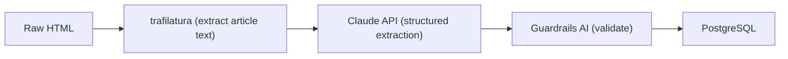

# ADR 004 — Recipe Parsing: LLM over Traditional Scraper

**Status:** Accepted

## Context

We need to extract structured recipe data (title, ingredients with quantities and units, steps, metadata) from arbitrary URLs — any cooking website, food blog, or app link. Traditional approaches use HTML scraping with CSS selectors or recipe schema.org microdata.

## Decision

Use **Claude API with structured output** (tool/function calling with a strict JSON schema) as the primary parsing strategy, with HTML extraction (trafilatura) as the pre-processing step.

Pipeline:

## Rationale

- **Robustness:** CSS selector scrapers are brittle — a site redesign breaks them. Claude reads the semantic content of a page regardless of HTML structure.
- **Handling variation:** Ingredient strings like "2 cloves garlic, finely minced" vs "garlic (2 cloves), minced" vs "2 garlic cloves" are trivially parsed by an LLM; rule-based parsers require extensive regex work and still fail on edge cases.
- **Structured output:** Claude's tool-calling API with a strict JSON schema reliably returns machine-readable output. Combined with Guardrails AI for validation, the error rate is acceptable.
- **No maintenance:** A traditional scraper library needs constant updates as sites change. The LLM approach requires only prompt tuning if output quality degrades.

## Trade-offs

- **Cost:** Each parse costs ~$0.01–0.05 in API tokens. At personal/household scale, this is negligible.
- **Latency:** Claude adds 3–8 seconds to the pipeline. Mitigated by the async job queue — users submit and come back.
- **Privacy:** Recipe URLs and content are sent to Anthropic's API. Acceptable for recipe data; would not be acceptable for sensitive domains.

## Alternatives Rejected

**CSS selector scraper:** Works on popular sites that publish schema.org/Recipe microdata (AllRecipes, NYT Cooking) but fails on food blogs, personal websites, and any site without structured markup. Requires a different scraper per site.

**recipe-scrapers library (Python):** Covers 300+ sites with hand-written scrapers. Good coverage but still misses many sites and requires community maintenance. Does not handle arbitrary URLs.
