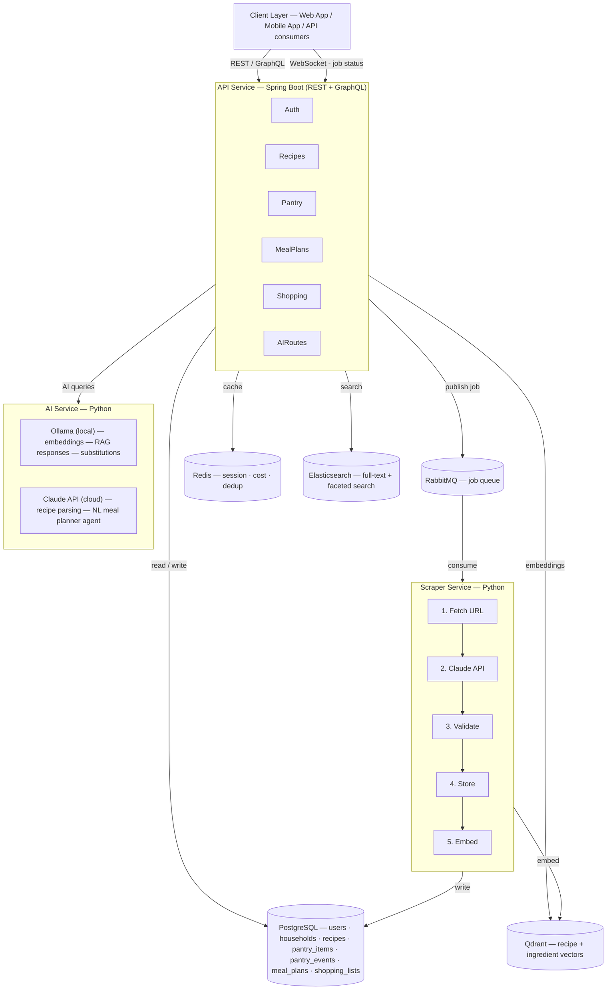
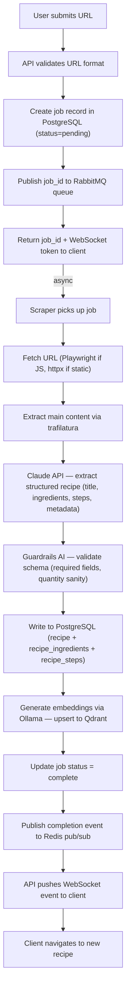
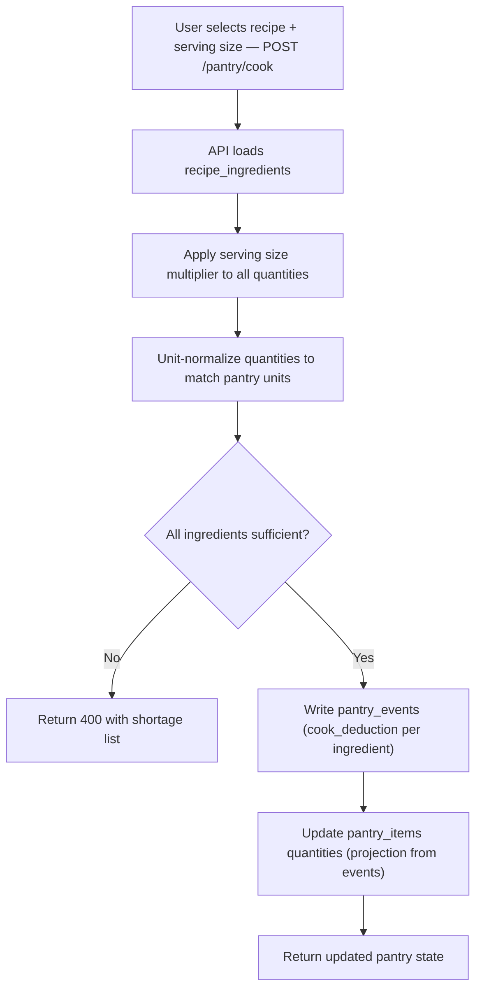
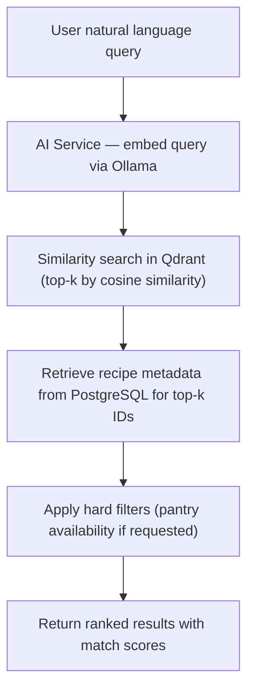

# Architecture

## System Overview

## Services

### API Service (`services/api/`) — Java 21 + Spring Boot 3
The central entry point. Handles all HTTP traffic — REST endpoints and GraphQL.

Responsibilities:
- Authentication (OAuth via Google, JWT issuance + refresh)
- Recipe CRUD and query
- Pantry state reads and writes (publishes pantry events)
- Meal plan management
- Shopping list generation and export
- Delegating scrape jobs to RabbitMQ
- Delegating AI queries to the AI service
- WebSocket connections for scrape job status

### Scraper Service (`services/scraper/`) — Python 3.12
A RabbitMQ consumer that processes recipe parsing jobs.

Pipeline per job:
1. Fetch raw HTML from URL (Playwright for JS-rendered pages, httpx for static)
2. Extract main content (trafilatura for article extraction)
3. Send extracted text to Claude API with a strict JSON schema → structured recipe
4. Validate output with Guardrails AI (required fields, sane values)
5. Write recipe + ingredients to PostgreSQL
6. Generate embeddings via Ollama → write to Qdrant
7. Update job status → notify API via Redis pub/sub → WebSocket push to client

### AI Service (`services/ai/`) — Python 3.12
Handles all LLM-powered features that require retrieval or multi-step reasoning.

Features:
- **Semantic search** (local): embed query via Ollama `nomic-embed-text` → Qdrant similarity search → return ranked recipes. No LLM generation step — results are returned directly.
- **RAG pipeline** (local): retrieve top-k recipes from Qdrant → inject context into Ollama `qwen2.5:14b` → generate natural language response. Used for "what can I make tonight?" and open-ended queries.
- **NL meal planner agent** (cloud): LangChain ReAct agent backed by `claude-haiku-4-5-20251001` with tools: `search_recipes`, `query_pantry`, `check_schedule`, `write_meal_plan`. Cloud required for reliable multi-step tool-calling.
- **Ingredient substitution** (local): few-shot prompt to Ollama `qwen2.5:14b`. Context is small and bounded; local quality is sufficient.
- **Shopping list consolidation** (algorithmic): unit conversion + quantity aggregation across recipes. No LLM required.

### Worker Service (`services/worker/`) — Python 3.12
Handles scheduled and periodic background jobs (separate from scrape jobs).

Jobs:
- Ingredient cost refresh (poll external grocery price API, update PostgreSQL)
- Expired meal plan cleanup
- Embedding re-indexing if schema changes

## Key Design Decisions

See `docs/adr/` for full reasoning. Summary:

| Decision | Choice | Alternative Rejected |
|---|---|---|
| Primary database | PostgreSQL | MongoDB — structured schema benefits outweigh flexibility |
| Pantry tracking | Event sourcing | Simple CRUD — audit trail and replay are valuable |
| Message broker | RabbitMQ | Kafka — simpler ops; Kafka overkill at this scale |
| Recipe parsing | Claude API (LLM) | HTML scraper — too brittle across different site formats |
| Embedding model | Ollama (local) | OpenAI Embeddings API — volume makes API cost add up |
| LLM boundary | Cloud (Haiku) for recipe parsing + NL agent; local (qwen2.5:14b) for RAG responses + substitutions | All cloud — cost and latency; all local — unreliable tool-calling for the agent |
| Vector DB | Qdrant | Pinecone — self-hostable; no cloud dependency |
| Search | Elasticsearch | PostgreSQL FTS — better faceting, fuzzy match, relevance tuning |
| RAG framework | From scratch first, then LlamaIndex | LlamaIndex only — need to understand the pipeline before abstracting it |
| Language stack | Split — Java + Spring Boot (API), Python (scraper / AI / worker) | Single language — no one language serves both OOP/DI and AI tooling goals equally well |

## Data Flow: Recipe Ingestion

## Data Flow: Pantry Deduction on Cook

## Data Flow: Semantic Recipe Search

## Scalability Notes

At household/personal scale, a single Docker Compose deployment on a MacBook or small VPS handles all load comfortably. The architecture is designed so each service can be independently scaled if ever needed:

- API Service: stateless → horizontal scale behind a load balancer
- Scraper Service: add more consumers → RabbitMQ distributes jobs
- AI Service: stateless → horizontal scale
- PostgreSQL: read replicas for query-heavy load
- Redis: single instance sufficient at this scale
- Elasticsearch: single-node sufficient; can add shards later
- Qdrant: single-node sufficient; supports distributed mode later
